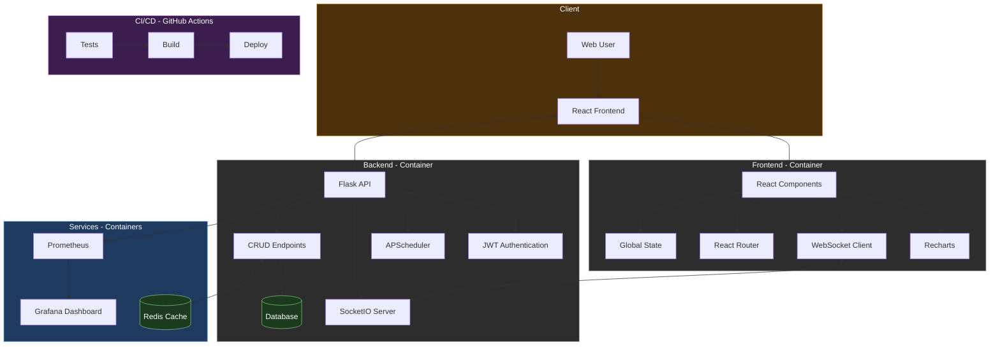

# Real-Time Resource Monitoring Dashboard

This project is a full-stack application offering an interactive and robust dashboard for real-time resource monitoring. The application integrates multiple technologies and software engineering practices to demonstrate a professional, scalable, and containerized environment.

---

## Table of Contents

- [Architecture and Diagram](#architecture-and-diagram)
- [Prerequisites](#prerequisites)
- [Available Docker Images](#available-docker-images)
- [Installation and Execution](#installation-and-execution)
  - [Development Execution](#development-execution)
  - [Execution in Docker Containers](#execution-in-docker-containers)
- [Application Features](#application-features)
  - [Backend](#backend)
  - [Frontend](#frontend)
  - [Additional Services and Improvements](#additional-services-and-improvements)
- [CI/CD and Automatic Deployment](#cicd-and-automatic-deployment)
- [Monitoring and Optimization](#monitoring-and-optimization)
- [Technical Stories and Achievements](#technical-stories-and-achievements)
- [Potential Future Improvements](#potential-future-improvements)
- [Credits and References](#credits-and-references)

---

## Architecture and Diagram

The application follows a modular architecture and is divided into two main parts:

- **Backend:**
  - Developed with Flask.
  - Implements JWT authentication, CRUD for users, and historical records.
  - Uses APScheduler to automatically insert simulated weather and seismicity data.
  - Utilizes Flask-SocketIO for real-time notifications.

- **Frontend:**
  - Built with React, using modular components and CSS Modules for a modern design.
  - Integrates interactive charts with Recharts to visualize historical weather and seismicity data.
  - Uses react-toastify for notifications and robust state and authentication management.

- **Additional Services and Orchestration:**
  - **Docker & Docker Compose:** The entire environment (backend, frontend, Redis, Prometheus, Grafana) is containerized to ensure consistent and scalable deployment.
  - **CI/CD:** Pipeline configured with GitHub Actions for automated testing and continuous deployment.
  - **Caching:** Use of Redis to cache responses and reduce calls to external APIs.
  - **Monitoring:** Prometheus and Grafana collect and visualize real-time performance metrics.
  - **WebSockets:** Used to send real-time notifications to the interface, eliminating constant polling.

### Architecture Diagram



---

## Prerequisites

- **Docker** and **Docker Compose** installed.
- **Git** for version control.
- GitHub access for CI/CD with GitHub Actions.
- Environment variables defined in a `.env` file (optional) for sensitive configurations like API keys, `SECRET_KEY`, etc.

---

## Available Docker Images

Below are the official images published on Docker Hub to facilitate the deployment of the backend and frontend of this project:

- **Backend:** [`26jeanca/dashboard-backend:v1.0`](https://hub.docker.com/r/26jeanca/dashboard-backend)
- **Frontend:** [`26jeanca/dashboard-frontend:v1.0`](https://hub.docker.com/r/26jeanca/dashboard-frontend)

### Quick Use

You can download and run the images directly with the following commands:

```bash
# Backend
 docker pull 26jeanca/dashboard-backend:v1.0
 docker run -d -p 5000:5000 26jeanca/dashboard-backend:v1.0

# Frontend
 docker pull 26jeanca/dashboard-frontend:v1.0
 docker run -d -p 3000:3000 26jeanca/dashboard-frontend:v1.0
```

These images are also used automatically when setting up the environment with `docker-compose`.

---

## Installation and Execution

### 🚀 Development Execution

<details open>
<summary><b>Detailed instructions for development environment</b></summary>

#### 1️⃣ Clone the repository

```bash
git clone https://github.com/jeancadev/real-time-dashboard.git
cd real-time-dashboard
```

#### 2️⃣ Configure the Backend environment

```bash
# Navigate to the backend directory
cd backend

# Create a virtual environment (optional but recommended)
python -m venv venv

# Activate the virtual environment
# On Windows:
venv\Scripts\activate
# On macOS/Linux:
source venv/bin/activate

# Install dependencies
pip install -r requirements.txt

# Configure environment variables (optional)
# Copy the .env.example file to .env and edit it according to your needs
cp .env.example .env
```

#### 3️⃣ Configure the Frontend environment

```bash
# Navigate to the frontend directory
cd ../frontend

# Install dependencies
npm install

# Configure environment variables (optional)
# Copy the .env.example file to .env and edit it according to your needs
cp .env.example .env
```

#### 4️⃣ Start the services

```bash
# Start the backend (from the backend directory)
cd ../backend
python run.py

# In another terminal, start the frontend (from the frontend directory)
cd ../frontend
npm start
```

#### 5️⃣ Access the application

Open your browser and access:
- Frontend: [http://localhost:3000](http://localhost:3000)
- Backend API: [http://localhost:5000](http://localhost:5000)

</details>

### 🐳 Execution in Docker Containers

<details open>
<summary><b>Detailed instructions for deployment with Docker</b></summary>

#### 1️⃣ Clone the repository

```bash
git clone https://github.com/jeancadev/real-time-dashboard.git
cd real-time-dashboard
```

#### 2️⃣ Configure environment variables (optional)

```bash
# Copy the .env.example file to .env and edit it according to your needs
cp .env.example .env
```

#### 3️⃣ Build and run the containers

```bash
# Build and start all services in the background
docker-compose up --build -d
```

#### 4️⃣ Verify that the containers are running

```bash
docker-compose ps
```

#### 5️⃣ Access the services

Once all containers are running, you can access:

- **Web Dashboard:** [http://localhost:3000](http://localhost:3000)
- **Backend API:** [http://localhost:5000](http://localhost:5000)
- **Prometheus:** [http://localhost:9090](http://localhost:9090)
- **Grafana:** [http://localhost:3001](http://localhost:3001) (username: admin | password: secret)

#### 6️⃣ Container management

```bash
# To view container logs
docker-compose logs -f

# To stop containers without removing them
docker-compose stop

# To start stopped containers
docker-compose start

# To restart containers
docker-compose restart

# To stop and remove containers
docker-compose down

# To stop and remove containers, volumes, and networks
docker-compose down --volumes
```

</details>

---

## Application Features

### Backend
- **Authentication and User Management:** User registration, login, and authentication with JWT.
- **Automatic Record Insertion:** Use of APScheduler to insert simulated weather and seismicity data.
- **REST API:** Endpoints to query, insert, update, and delete records with pagination and filters.
- **WebSockets:** Use of Flask-SocketIO to send real-time notifications to users.
- **Response Caching:** Use of Redis to cache responses and reduce calls to external APIs.
- **Metrics and Monitoring:** Integration with Prometheus to collect performance metrics and Grafana to visualize them.

### Frontend
- **Modern Interface:** Built with React, modular components, and smooth animations.
- **Historical Data Visualization:** Interactive charts with Recharts to visualize historical weather and seismicity data.
- **Real-Time Notifications:** Use of react-toastify for action alerts and authentication changes.
- **Pagination and Filter Controls:** Implementation of pagination and filters for large volumes of data.

### Additional Services and Improvements
- **Docker & Docker Compose:** Full containerization to ensure a consistent and scalable environment.
- **CI/CD with GitHub Actions:** Automated pipeline for tests, builds, and continuous deployment.
- **Monitoring:** Integration with Prometheus and Grafana dashboards to collect and visualize performance metrics.
- **Cache:** Redis to improve performance on repetitive queries.
- **WebSockets:** For real-time notifications, eliminating the need for constant polling.

### CI/CD and Automatic Deployment
We use GitHub Actions to automate the quality and deployment of the application. Each push to the main branch triggers the pipeline which:
- **Runs tests on the backend.**
- **Builds the frontend application.**
- **Automatically deploys the application to the server via SSH and Docker Compose.**
The pipeline is defined in `.github/workflows/main.yml` and can be customized according to project needs.

### Monitoring and Optimization
- **Prometheus:** Running at http://localhost:9090, collects metrics from the backend.
- **Grafana:** Dashboard at http://localhost:3001, visualizes metrics collected by Prometheus (default username/password: admin/secret).
- **Redis:** Response caching to improve performance and reduce load on the backend.

### Technical Stories and Achievements
- **WebSockets and Real-Time Notifications:** Successful integration of Flask-SocketIO and react-toastify.
- **CI/CD Pipeline:** Automation of tests, builds, and continuous deployment with GitHub Actions.
- **Optimization and Scalability:** Use of APScheduler, Redis, pagination, and filters to handle large data volumes.
- **Full Containerization:** Docker and Docker Compose orchestrate the entire application environment.

### Potential Future Improvements
- **HTTPS Integration and Additional Security:** Configure HTTPS with Nginx and Let's Encrypt.
- **UI/UX Refinement:** Improve animations, transitions, and user experience.
- **Advanced WebSockets:** Custom notifications and real-time updates for other components.
- **Query and Cache Optimization:** Review Redis usage and optimize database queries.
- **Horizontal Scalability:** Prepare the system for scalability with Kubernetes or Docker Swarm.

### Credits and References
- **Flask & Flask-SocketIO:** [Flask](https://flask.palletsprojects.com/) & [Flask-SocketIO](https://flask-socketio.readthedocs.io/en/latest/)
- **React & Recharts:** [React](https://reactjs.org/) & [Recharts](https://recharts.org/en-US/)
- **Docker & Docker Compose:** [Docker](https://www.docker.com/) & [Docker Compose](https://docs.docker.com/compose/)
- **Redis:** [Redis](https://redis.io/)
- **Prometheus & Grafana:** [Prometheus](https://prometheus.io/) & [Grafana](https://grafana.com/)
- **GitHub Actions:** [GitHub Actions](https://docs.github.com/en/actions)
