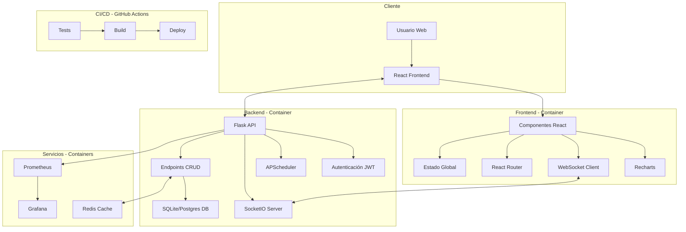

# Dashboard de Monitoreo de Recursos en Tiempo Real

Este proyecto es una aplicación full‑stack que ofrece un dashboard interactivo y robusto para el monitoreo de recursos en tiempo real. La aplicación integra múltiples tecnologías y prácticas de ingeniería de software para demostrar un entorno profesional, escalable y contenedorizado.

---

## Índice

- [Arquitectura y Diagrama](#arquitectura-y-diagrama)
- [Requisitos Previos](#requisitos-previos)
- [Imágenes Docker Disponibles](#imágenes-docker-disponibles)
- [Instalación y Ejecución](#instalación-y-ejecución)
  - [Ejecución en Desarrollo](#ejecución-en-desarrollo)
  - [Ejecución en Contenedores Docker](#ejecución-en-contenedores-docker)
- [Características de la Aplicación](#características-de-la-aplicación)
  - [Backend](#backend)
  - [Frontend](#frontend)
  - [Servicios y Mejoras Adicionales](#servicios-y-mejoras-adicionales)
- [CI/CD y Despliegue Automático](#cicd-y-despliegue-automático)
- [Monitoreo y Optimización](#monitoreo-y-optimización)
- [Historias y Logros Técnicos](#historias-y-logros-técnicos)
- [Posibles Mejoras Futuras](#posibles-mejoras-futuras)
- [Créditos y Referencias](#créditos-y-referencias)

---

## Arquitectura y Diagrama

La aplicación sigue una arquitectura modular y se divide en dos grandes partes:

- **Backend:**  
  - Desarrollado con Flask.
  - Implementa autenticación con JWT, CRUD para usuarios y registros históricos.
  - Emplea APScheduler para insertar datos simulados de clima y sismicidad de forma automática.
  - Utiliza Flask-SocketIO para notificaciones en tiempo real.
  
- **Frontend:**  
  - Construido con React, utilizando componentes modulares y CSS Modules para un diseño moderno.
  - Integra gráficos interactivos con Recharts para visualizar datos históricos de clima y sismicidad.
  - Emplea react-toastify para notificaciones y una gestión robusta de estados y autenticación.
  
- **Servicios Adicionales y Orquestación:**  
  - **Docker & Docker Compose:** El entorno completo (backend, frontend, Redis, Prometheus, Grafana) se contenedorizó para garantizar un despliegue consistente y escalable.
  - **CI/CD:** Pipeline configurado con GitHub Actions para pruebas automatizadas y despliegue continuo.
  - **Caching:** Uso de Redis para cachear respuestas y reducir llamadas a APIs externas.
  - **Monitoreo:** Prometheus y Grafana recolectan y visualizan métricas del rendimiento en tiempo real.
  - **WebSockets:** Se utilizan para enviar notificaciones en tiempo real a la interfaz, eliminando el polling constante.

### Diagrama de Arquitectura



---

## Requisitos Previos

- **Docker** y **Docker Compose** instalados.
- **Git** para el control de versiones.
- Acceso a GitHub para el CI/CD con GitHub Actions.
- Variables de entorno definidas en un archivo `.env` (opcional) para configuraciones sensibles como claves API, `SECRET_KEY`, etc.

---

## Imágenes Docker Disponibles

A continuación se listan las imágenes oficiales publicadas en Docker Hub para facilitar el despliegue del backend y frontend de este proyecto:

- **Backend:** [`26jeanca/dashboard-backend:v1.0`](https://hub.docker.com/r/26jeanca/dashboard-backend)
- **Frontend:** [`26jeanca/dashboard-frontend:v1.0`](https://hub.docker.com/r/26jeanca/dashboard-frontend)

### Uso rápido

Puedes descargar y ejecutar las imágenes directamente con los siguientes comandos:

```bash
# Backend
 docker pull 26jeanca/dashboard-backend:v1.0
 docker run -d -p 5000:5000 26jeanca/dashboard-backend:v1.0

# Frontend
 docker pull 26jeanca/dashboard-frontend:v1.0
 docker run -d -p 3000:3000 26jeanca/dashboard-frontend:v1.0
```

Estas imágenes también son utilizadas automáticamente al levantar el entorno con `docker-compose`.

---

## Instalación y Ejecución

### Ejecución en Desarrollo

1. Clona el repositorio:

   git clone https://github.com/jeancadev/real-time-dashboard.git
   cd real-time-dashboard
2. Instala las dependencias del backend:

   cd backend
   pip install -r requirements.txt
3. Instala las dependencias del frontend:

   cd ../frontend
   npm install
4. Inicia el backend en modo desarrollo (python run.py)
5. Inicia el frontend (npm start)

6. Accede a la aplicación en `http://localhost:3000`.

### Ejecución en Contenedores Docker
1. Se configura correctamente el archivo `docker-compose.yml` para definir los servicios necesarios (backend, frontend, Redis, Prometheus y Grafana).
Ademas se configura el archivo `Dockerfile` para el backend y frontend.

2. Construye y ejecuta los contenedores desde la raíz del proyecto ejecuta:

   docker-compose up --build -d

3. La aplicación se desplegara en;
    
    - Backend: `http://localhost:5000`
    - Frontend: `http://localhost:3000`
    - Redis: `http://localhost:6379`
    - Prometheus: `http://localhost:9090`
    - Grafana: `http://localhost:3001` (usuario y contraseña por defecto: admin/secret)

4. Para detener los contenedores sin removerlos, ejecuta:

   docker-compose stop

5. Para reiniciar los contenedores, ejecuta:

   docker-compose start

6. Para eliminar los contenedores y redes creadas, ejecuta:
   docker-compose down

7. Para removerlos (incluyendo volúmenes y redes), ejecuta:  

   docker-compose down --volumes

### Características de la Aplicación

Backend
- **Autenticación y Gestión de usuarios:** Registro, login y autenticación de usuarios con JWT.
- **Inserción Automática de Registros:** Uso de APScheduler para insertar datos simulados de clima y sismicidad.
- **API REST:** Endpoints para consultar, insertar, actualizar y eliminar registros con paginación y filtros.
- **WebSockets:** Uso de Flask-SocketIO para enviar notificaciones en tiempo real a los usuarios.
- **Cacheo de Respuestas:** Uso de Redis para cachear respuestas y reducir llamadas a APIs externas.
- **Métricas y Monitoreo:** Integración con Prometheus para recolectar métricas de rendimiento y Grafana para visualizarlas.

Frontend
- **Interfaz Moderna:** Construida con React, componentes modulares y animaciones suaves.
- **Visualización de Datos Históricos:** Graficos interactivos con Recharts para visualizar datos históricos de clima y sismicidad.
- **Notificaciones en Tiempo Real:** Uso de react-toastify para alertas de acciones y cambios en la autenticación.
- **Controles de Paginación y Filtros:** Implementación de paginación y filtros para grandes volumenes de datos.

### Servicios y Mejoras Adicionales
- **Docker & Docker Compose:** Contenerización completa para garantizar un entorno consistente y escalable.
- **CI/CD con GitHub Actions:** Pipeline automatizado para tests, builds y despliegue continuo.
- **Monitoreo:** Integración con Prometheus y paneles de Grafana para recolectar y visualizar métricas de rendimiento.
- **Cache:** Redis para mejorar el rendimiento en consultas repetitivas.
- **WebSockets:** Para notificaciones en tiempo real, eliminando la necesidad de polling constante.

### CI/CD y Despliegue Automático
Utilizamos GitHub Actions para automatizar la calidad y despliegue de la aplicación. Cada push a la rama principal activa el pipeline que:
- **Ejecuta test en el backend.**
- **Construye la aplicación frontend.**
- **Despliega automáticamente la aplicación en el servidor mediante SSH y Docker Compose.**
El pipeline se define en .github/workflows/main.yml y se puede personalizar según las necesidades del proyecto.

### Monitoreo y Optimización
- **Prometheus:** Corriendo en http://localhost:9090, recolecta métricas del backend.
- **Grafana:** Dashboard en http://localhost:3001, visualiza las métricas recolectadas por Prometheus (usuario y contraseña por defecto: admin/secret).
- **Redis:** Cacheo de respuestas para mejorar el rendimiento y reducir la carga en el backend.

### Historias y Logros Técnicos
- **WebSockets y Notificaciones en Tiempo Real:** Integración exitosa de Flask-SocketIO y react-toastify.
- **Pipeline de CI/CD:** Automatización de tests, builds y despliegue continuo con GitHub Actions.
- **Optimización y Escalabilidad:** Uso de APScheduler, Redis, paginación y filtros para manejar grandes volúmenes de datos.
- **Contenerización Completa:** Docker y Docker Compose orquestan todo el entorno de la aplicación.

### Posibles Mejoras Futuras
- **Integración de HTTPS y Seguridad Adicional:** Configurar HTTPS con Nginx y Let's Encrypt.
- **Refinamiento de UI/UX:** Mejorar animaciones, transiciones y la experiencia de usuario.
- **WebSockets Avanzados:** Notificaciones personalizadas y actualizaciones en tiempo real para otros componentes.
- **Optimización de Consultas y Caché:** Revisar el uso de Redis y optimizar consultas a la base de datos.
- **Escalabilidad Horizontal:** Preparar el sistema para escalabilidad con Kubernetes o Docker Swarm.

### Créditos y Referencias
- **Flask y Flask-SocketIO:** [Flask](https://flask.palletsprojects.com/) y [Flask-SocketIO](https://flask-socketio.readthedocs.io/en/latest/)
- **React y Recharts:** [React](https://reactjs.org/) y [Recharts](https://recharts.org/en-US/)
- **Docker y Docker Compose:** [Docker](https://www.docker.com/) y [Docker Compose](https://docs.docker.com/compose/)
- **Redis:** [Redis](https://redis.io/)
- **Prometheus y Grafana:** [Prometheus](https://prometheus.io/) y [Grafana](https://grafana.com/)
- **GitHub Actions:** [GitHub Actions](https://docs.github.com/en/actions)
